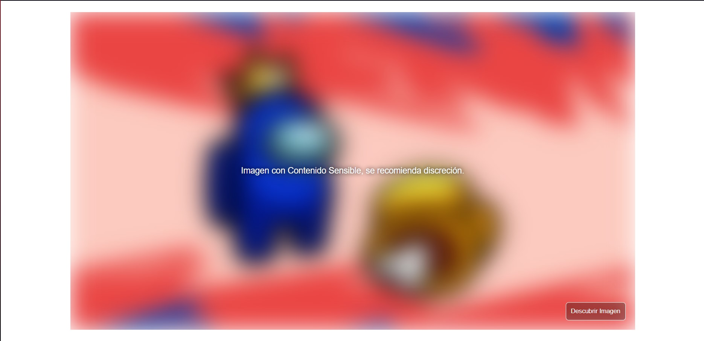
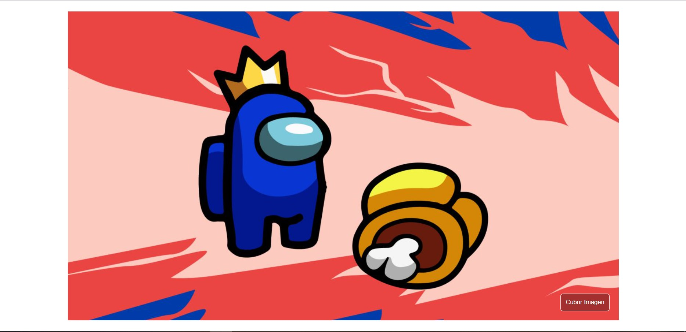

# Imagen-Censurada-en-JS
Ejemplo de como hacer una imagen censurada que se puede revelar fácilmente con un botón, Ejemplo hecho en HTML, CSS y JS

  
    
  
    
  
  

## ¿Cuál es el fin de este proyecto?
Es una simple pagina hecha en HTML, CSS y JavaScript. 
Su objetivo no es mas que el aprendisaje y practica de herramientas que nos puede proporcionar JavaScript.
Las Imagenes y el código original, derechos y agradecimientos a sus respectivos dueños y creadores por el contenido.

## ¿Puedo Probarlo en Linea? 
Si, Puedes probarlo en linea haciendo click [aqui](https://carlosorellana00.github.io/Imagen-Censurada-en-JS/)

## ¿Cómo puedo probarlo de manera local en mi equipo?
puede copiarse directamente desde git a traves de comando o descargarse en un archivo Zip, el proyecto no requiere de ningun servicio de servidor para correrse
de manera local en una computadora.

## Modo de uso

El Programa se nos presenta de forma sensilla al abrir la vista.

se nos presenta un recuadro nublado donde esta la imagen en un recuadro en su interior con un texto de advertencia y un botón que nos permitira descensurar la imagen.

  

Al hacer click sobre el botón se nos revelara la iamgen censurada y el botón cambia de funcion para censurar la imagen de forma reversiva. 

  

## Agradecimientos:

- [Autor Original ->  DarkCode](https://www.youtube.com/c/DarkCodeOnline)
- [Código Original -> Cover and Uncover an image Using Javascript](https://www.youtube.com/watch?v=3bltfKyHG50)

